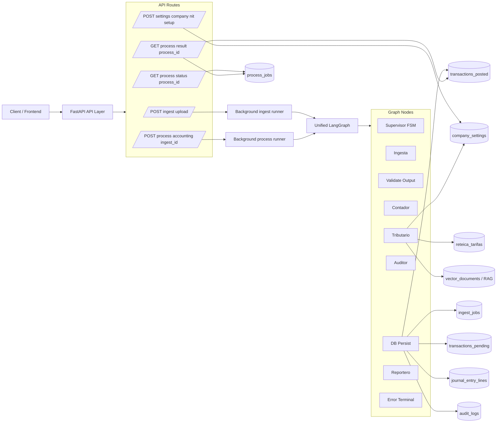
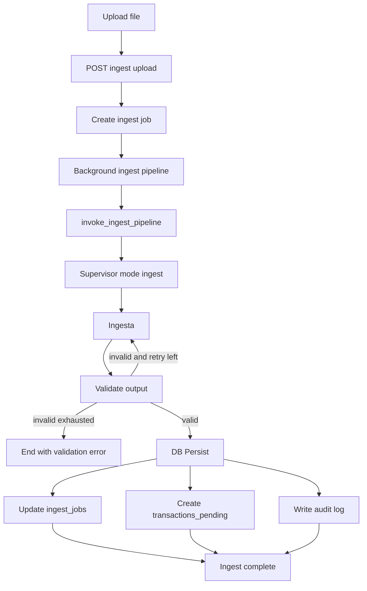
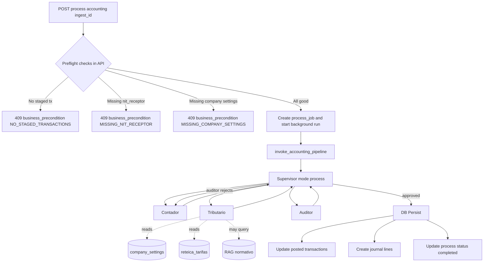
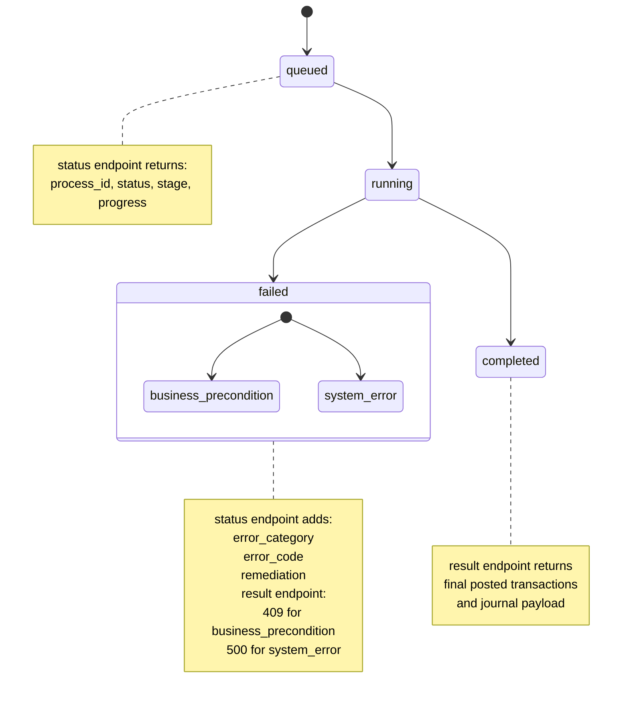

# Architecture and Flow Diagrams

This document explains the current system architecture and runtime behavior using Mermaid diagrams.

## 1) System Architecture Overview

Key idea:
- One unified graph handles multiple modes.
- API routes orchestrate background jobs and expose polling/result endpoints.

## 1.1) FSM State Catalog (Unified Graph)

The unified LangGraph finite-state machine has 9 explicit runtime states:

1. supervisor
  Purpose: central router and gatekeeper.
  Behavior: reads mode and current_agent, applies validation/routing rules, and decides the next state.

2. ingesta
  Purpose: document extraction and transaction interpretation.
  Behavior: parses source files and builds structured extracted data for ingest mode.

3. validate_output
  Purpose: schema validation and retry control for ingest output.
  Behavior: validates extracted payload, emits correction feedback, loops to ingesta on retryable errors, or advances to persistence.

4. contador
  Purpose: accounting classification.
  Behavior: classifies transactions into accounting entries and produces contador output for downstream tax/audit checks.

5. tributario
  Purpose: tax calculation and legal grounding.
  Behavior: computes retefuente, reteica, and IVA; enriches entries; loads company tax config and fails fast in process mode when required settings are missing.

6. auditor
  Purpose: accounting quality and compliance decision.
  Behavior: validates consistency and can approve, reject (loop back to contador), or fail the process.

7. db_persist
  Purpose: centralized persistence layer.
  Behavior: writes ingest/process outputs to DB (jobs, pending/posted transactions, journal lines, audit logs) and updates job statuses.

8. reportero
  Purpose: reporting mode terminal worker.
  Behavior: generates reporting outputs and exits without accounting persistence flow.

9. error_terminal
  Purpose: controlled failure sink.
  Behavior: ends execution when a non-recoverable error is detected upstream.

Note:
- LangGraph also has internal start/end markers, but they are framework boundary states rather than business runtime states.

## 2) Pipeline 1: Ingest Flow

Key idea:
- Ingest focuses on extraction and staging.
- Validation and retry happen before persistence.

## 3) Pipeline 2: Accounting Flow with Fail-Fast Preconditions

Key idea:
- Accounting processing is guarded by business preconditions.
- Tributario no longer silently defaults in process mode when required company settings are missing.

## 4) Process Status and Result Error Contract

Key idea:
- Failed jobs are now typed for clients.
- Consumers can automate handling with category plus code plus remediation.

## Suggested Presentation Sequence

1. Start with architecture overview.
2. Show ingest flow first.
3. Show accounting flow and fail-fast points.
4. End with error contract to explain API behavior for frontend and integrations.
