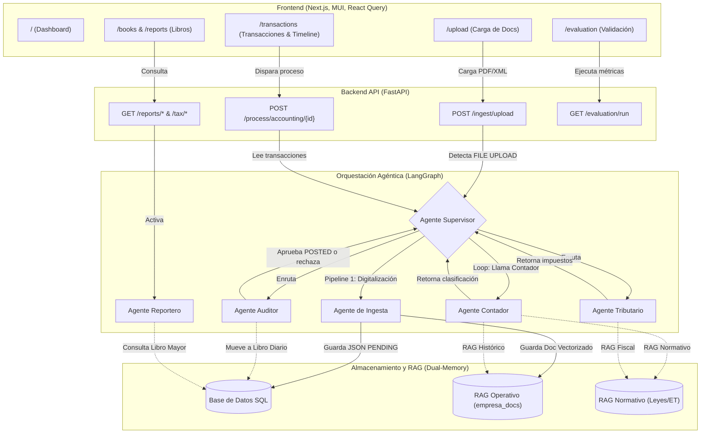

# Diagrama de Arquitectura del Sistema Agéntico Contable

Status: Done
Sprint: Sprint 1
Assignee: Juan Pablo Mejia Gomez
Due Date: February 14, 2026

```mermaid
graph TD
    subgraph Capa_Frontend ["Frontend (Next.js, MUI, React Query)"]
        UI_Dash["/ (Dashboard)"]
        UI_Upload["/upload (Carga de Docs)"]
        UI_Trans["/transactions (Transacciones & Timeline)"]
        UI_Books["/books & /reports (Libros)"]
        UI_Eval["/evaluation (Validación)"]
    end

    subgraph Capa_API ["Backend API (FastAPI)"]
        API_Ingest["POST /ingest/upload"]
        API_Process["POST /process/accounting/{id}"]
        API_Reports["GET /reports/* & /tax/*"]
        API_Eval["GET /evaluation/run"]
    end

    subgraph Capa_Orquestacion ["Orquestación Agéntica (LangGraph)"]
        Supervisor{"Agente Supervisor"}
        Ag_Ingesta["Agente de Ingesta"]
        Ag_Contador["Agente Contador"]
        Ag_Tributario["Agente Tributario"]
        Ag_Auditor["Agente Auditor"]
        Ag_Reportero["Agente Reportero"]
    end

    subgraph Capa_Datos ["Almacenamiento y RAG (Dual-Memory)"]
        DB_SQL[("Base de Datos SQL")]
        DB_RAG_Op[("RAG Operativo (empresa_docs)")]
        DB_RAG_Norm[("RAG Normativo (Leyes/ET)")]
    end

    %% Conexiones Frontend -> API
    UI_Upload -->|"Carga PDF/XML"| API_Ingest
    UI_Trans -->|"Dispara proceso"| API_Process
    UI_Books -->|"Consulta"| API_Reports
    UI_Eval -->|"Ejecuta métricas"| API_Eval

    %% Conexiones API -> Supervisor
    API_Ingest -->|"Detecta FILE UPLOAD"| Supervisor
    API_Process -->|"Lee transacciones"| Supervisor
    
    %% Pipeline 1: Ingestión
    Supervisor -->|"Pipeline 1: Digitalización"| Ag_Ingesta
    Ag_Ingesta -->|"Guarda Doc Vectorizado"| DB_RAG_Op
    Ag_Ingesta -->|"Guarda JSON PENDING"| DB_SQL

    %% Pipeline 2: Procesamiento
    Supervisor -->|"Loop: Llama Contador"| Ag_Contador
    Ag_Contador -->|"Retorna clasificación"| Supervisor
    Supervisor -->|"Enruta"| Ag_Tributario
    Ag_Tributario -->|"Retorna impuestos"| Supervisor
    Supervisor -->|"Enruta"| Ag_Auditor
    Ag_Auditor -->|"Aprueba POSTED o rechaza"| Supervisor

    %% Interacciones de Agentes con Bases de Datos
    Ag_Contador -.->|"RAG Histórico"| DB_RAG_Op
    Ag_Contador -.->|"RAG Normativo"| DB_RAG_Norm
    Ag_Tributario -.->|"RAG Fiscal"| DB_RAG_Norm
    Ag_Auditor -.->|"Mueve a Libro Diario"| DB_SQL
    Ag_Reportero -.->|"Consulta Libro Mayor"| DB_SQL
    API_Reports -->|"Activa"| Ag_Reportero
```