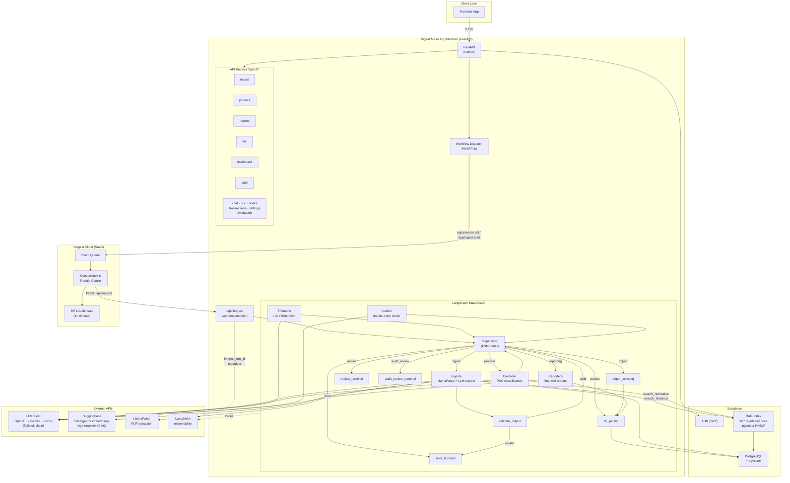

# Hosting Architecture Decision

## System Architecture Diagram



**Date:** 2026-05-28  
**Status:** Decided — pending migration from Render free tier

---

## Current Problem

Render free tier spins down after 15 minutes of inactivity. When Inngest Cloud calls back the `/api/inngest` webhook, the server is asleep → webhook times out → pipeline never completes. Additionally, `WORKFLOW_ENGINE` is not set in `render.yaml`, so it defaults to `inline` — meaning all LangGraph pipelines run inside the FastAPI process itself. Multiple concurrent document uploads collapse the server.

---

## Target Architecture

```
Frontend
    ↓
[DigitalOcean App Platform] — FastAPI, always-on, $5–12/mo
    ↓ dispatches event
[Inngest Cloud] — free tier (3M steps/mo), external SaaS
    ↓ calls back webhook (never times out — DO never sleeps)
[DigitalOcean App Platform] — LangGraph pipeline executes
    ↓
[Supabase] — PostgreSQL + pgvector + Auth (stays as-is, free tier)
```

### Component Responsibilities

**DigitalOcean App Platform**
- Runs FastAPI 24/7, never sleeps
- Serves HTTP requests from frontend
- Exposes `/api/inngest` webhook endpoint for Inngest callbacks
- Executes LangGraph pipelines when Inngest triggers them
- Runs `alembic upgrade head` on each deploy

**Inngest Cloud**
- Receives events (`app/process.start`, `app/ingest.start`)
- Enforces per-NIT concurrency (max 5 pipelines per company)
- Enforces OpenAI throttle (400 req/min cluster-wide)
- Deduplicates double-dispatched jobs
- Retries failed pipeline steps
- Holds HITL audit confirmation gate (up to 1h, survives restarts)
- Provides dashboard for inspecting every run

**Supabase** (unchanged)
- PostgreSQL + pgvector for all data and RAG
- Auth (JWT)
- No migration needed — `DATABASE_URL` stays the same

---

## Cost

| Service | Cost |
|---------|------|
| DO App Platform (1 web service, Basic) | $5–12/mo |
| Inngest Cloud | $0 (free tier: 3M steps/mo) |
| Supabase | $0 (free tier) |
| **Total** | **$5–12/mo** |

DigitalOcean GitHub Education credit: **$200** (~16–40 months free).

---

## Why Not Render

| | Render Free | DO App Platform ($5/mo) |
|--|--|--|
| Sleeps after inactivity | Yes (15 min) | No |
| Inngest callbacks work | No (timeouts) | Yes |
| Always-on HTTP | No | Yes |
| Cost | $0 | $5/mo (covered by DO credits) |

Render paid tier ($7/mo) would also fix the sleep problem but wastes the $200 DO credits.

---

## Migration Steps

1. Create DO App Platform app — connect GitHub repo (`main` branch)
2. Copy all env vars from Render dashboard to DO dashboard
3. Add missing env vars:
   ```
   WORKFLOW_ENGINE=inngest
   INNGEST_EVENT_KEY=<from Inngest Cloud dashboard>
   INNGEST_SIGNING_KEY=<from Inngest Cloud dashboard>
   INNGEST_IS_PRODUCTION=true
   INNGEST_DEV=false
   ```
4. Update `ALLOWED_ORIGINS` to include new DO app URL
5. Create Inngest Cloud account if not done — set serve URL to `https://<your-app>.ondigitalocean.app/api/inngest`
6. Verify first deploy: health check at `/health`, test one document ingest end-to-end

No code changes required. Pure config migration.

---

## Production Upgrade Path

| Stage | Setup |
|-------|-------|
| Academic/demo (now) | DO App Platform Basic + Inngest free tier |
| Production v1 | DO App Platform Professional + Inngest free/paid |
| Production v2 | Evaluate Temporal (self-hosted) if Inngest limits hit or vendor lock-in becomes concern |

---

## Related Files

- `render.yaml` — current Render config (reference for env vars)
- `app/workflows/dispatch.py` — Inngest dispatch logic
- `app/workflows/inngest_client.py` — Inngest client singleton
- `app/workflows/functions/process_pipeline.py` — process Inngest function
- `app/workflows/functions/ingest_pipeline.py` — ingest Inngest function
- `app/core/config.py` — `workflow_engine`, `INNGEST_*` settings
- `main.py:170` — Inngest serve mount (activated when `workflow_engine == "inngest"`)
